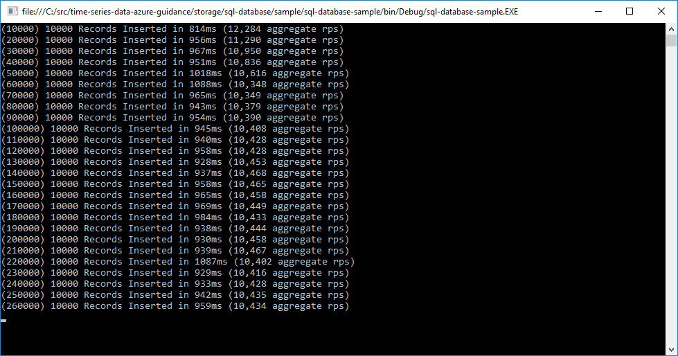

# SQL Server for Time Series Data Storage

Let's explore the possibility of using SQL Database for the storage of time series data. SQL Database is a relational database-as-a-service that is entirely managed for you. It offers features such as predictable performance that you can dial up or down, high availability, data protection options such as restore and geo-replication. It's also fully compatible with most existing applications that are using SQL Server, so it plays a vital role in applications being migrated to the cloud.

Since SQL Server is already part of many architectures, it makes sense to evaluate its effectiveness for basic time series data storage. It's maturity and obiquity makes it an interesting option.

**Important Note:** Performance numbers are only to give a general idea about what performance is possible. They should not be considered official or unofficial benchmarks.

## Write Performance

How do we get data quickly into SQL Database? In order to see what was possible, I created a sample console application in .NET to bulk insert records. This sample uses a custom [DbDataReader](https://msdn.microsoft.com/en-us/library/system.data.common.dbdatareader(v=vs.110).aspx) class to generate random time-series values.

With the lowest end SQL Database, I was able to insert about 4,000 records per second consistently. I repeated this test over the internet, and within the same resource group as the database. Locality didn't affect throughput, although it likely affected latency. Using a larger, P0 instance, I was able to insert about 10,000 records each second. Either of these numbers should be acceptable for the majority of scenarios.

## Random Access Performance

*Coming Soon*

## Batch Reads

*Coming Soon*

## Aggregation

*Coming Soon*

## Storage Efficiency

SQL Database and SQL Server both use a schema-based relational approach to storing data. When contrasted with schema-less approaches, this is far more efficient. There is no need to store column metadata with each record. Additionally, looking up metadata about the datasource itself is a fast operation, so it's easy to separate (normalize) the information about the data source.

Here is one possible table configuration:

    CREATE TABLE [dbo].[Data](
        [Timestamp] [datetime] NOT NULL,
        [DatsourceId] [int] NOT NULL,
        [Value] [varbinary](max) NOT NULL
        
We're using the `DatasourceId` as a lookup for the datasource details. We left the datasource metadata table out of the sample.

The `Value` column is of type `varbinary`. This column type favors flexibility over efficiency. It allows the storage of any possible type of data. Later, we'll run tests with a more specific data type.

SQL Database supports [page level compression](https://msdn.microsoft.com/en-us/library/cc280464.aspx). This is a form of compression that will compress data across multiple rows. The repetitiveness of rows provides a very high level of compression.

Turning on compression is simple:

    ALTER TABLE Dbo.Data REBUILD PARTITION = ALL
    WITH (DATA_COMPRESSION = PAGE);
    
With compression on, we're able to store 10 million rows in approximately 375,000 KB. When we factor in the index size of 455,000 KB, our average record size is **81 bytes**.

<table>
    <tr>
        <td>Level</td>
        <td>DTUs</td>
        <td>Space (GB)</td>
        <td>Records</td>
        <td>Approx. Insert Rate</td>
    </tr>
    <tr>
        <td>S0</td>
        <td>15</td>
        <td>250</td>
        <td>3,318,702,167</td>
        <td>4,000</td>
    </tr>
    <tr>
        <td>P1</td>
        <td>125</td>
        <td>500</td>
        <td>6,637,404,334</td>
        <td>9,900</td>
    </tr>
</table>

In summary, we're able to store billions of records with even the most inexpensive SQL Database option.

## Cost

Current pricing can be found [here on the Azure website](https://azure.microsoft.com/en-us/pricing/details/sql-database/?b=16.50).

Using the S0 option, pricing can be around $15 per month. It's a simple operation if the database needs to be scaled up. In my testing, I scaled from an S0 to a P1. The scaling operation breaks the connection, so be sure to implement a [transient fault handling solution](https://msdn.microsoft.com/en-us/library/hh680934%28v=pandp.50%29.aspx).

Thanks to the high storage efficiency of SQL Database (see above), we can choose an edition of SQL Database based on our compute requirements and not storage requirements.

## Interpolation

*Coming Soon*

## Interoperability

SQL Database is *great* for compatibility with other products. Many products have direct support, including Azure Stream Analytics, Azure Machine Learning, PowerBI, and more.

## High Availability & Disaster Recovery

There is [extensive documentation available](https://azure.microsoft.com/en-us/documentation/articles/sql-database-business-continuity/) on the Azure documentation site.